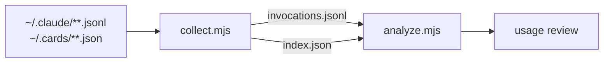

# wiki-cli-analysis

Answering "how is the wiki CLI actually being used?" means separating real invocations from the flood of incidental `wiki` strings in this repo (the project itself is named wiki, paths like `.wiki/` and `npm/wiki-*` are everywhere, and grep patterns quote subcommand names). This skill is a two-tool pipeline that makes that separation structurally:



## The two tools

### `scripts/collect.mjs`

The single corpus-walking choke point. Parses both sources once and writes one normalized intermediate plus a per-file index:

```
node scripts/collect.mjs [--claude-root=<path>] [--cards-root=<path>] [--out=<path>] [--index-out=<path>]
```

- `--claude-root=<path>` — default `~/.claude`; globs `**/*.jsonl`
- `--cards-root=<path>` — default `~/.cards`; globs `**/*.json`, walks every string value recursively
- outputs default alongside the script (`invocations.jsonl`, `index.json`)

An invocation is recorded only when the `wiki` binary appears in **executable position** after shell segmentation: the segment is split on unquoted operators (`&&`, `||`, `|`, `;`, newlines) and command substitutions (`$(...)`, backticks, including inside double quotes), leading env assignments and wrapper words (`cd`, `timeout`, `sudo`, `time`, `xargs`, …) are stripped, and the first remaining token must be exactly `wiki`, end in `/wiki`, or be `wiki.exe`. Everything else — `git add npm/wiki-darwin-arm64/...`, `grep "wiki check\|wiki pin"`, `ls target/release/wiki`, `strings .../wiki | grep`, bare `bin/wiki.exe` declarations, URLs — is not an invocation and is dropped by design. Bash results are joined back by `tool_use_id` so each record carries its outcome (`ok` / `error` / `unknown`, exit code when present, stdout head).

Output record shape (`invocations.jsonl`): `{source, file, cwd, timestamp, ordinal, toolUseId, jsonPath, mentionKind, command, segment, bin, sub, flags, positionalCount, query, outcome}`. Cards-JSON records carry `mentionKind: prose-mention` (found in card titles/summaries/descriptions — evidence of what developers write about the CLI) versus `embedded-command`.

### `scripts/analyze.mjs`

Reads the intermediate and prints the usage review: totals, invocation style breakdown (bare PATH lookup vs `target/debug` vs `target/release` vs other build-dir binaries), subcommand frequency, flag frequency, outcome join rate, most repeated commands, search-style queries, and error samples:

```
node scripts/analyze.mjs [--in=<path>] [--top=<n>] [--json]
```

## Running

```bash
cd .claude/skills/wiki-cli-analysis/scripts
node test-detect.mjs   # pins the detector contract (12 cases)
node collect.mjs
node analyze.mjs
```

## Failure modes handled by design

- Quoted `|` alternations in grep patterns are the classic false positive; segmentation is quote-aware so `"wiki check\|wiki pin"` never becomes an invocation.
- Unparseable transcript lines and unreadable files are skipped and counted, never fatal; an empty corpus prints a warning distinct from a crash.
- `$WIKI_BIN`-style variable-indirect invocations are **not** resolved — a documented blind spot, asserted in `test-detect.mjs`.
- Card titles like *"wiki check --fix"* are classified as `prose-mention`, not counted as executions.

## Out of scope

Not a quality judgment of the CLI's output, not a token-cost analysis of hook emissions (see the git-span `hook-effect-analysis` skill for that pattern), and no placebo/baseline statistics — this answers *what was run*, not *whether running it paid off*.
