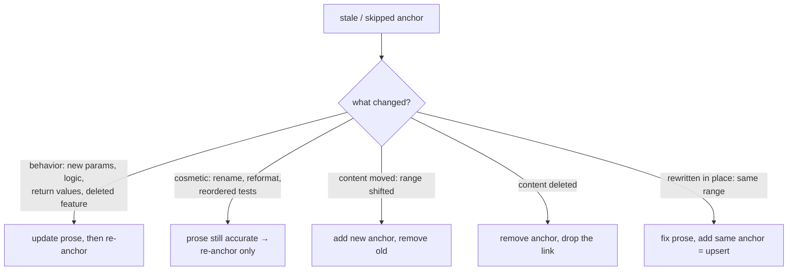

# Resolving skipped fixes

`wiki check --fix` fail-closes on mesh drift it can't resolve automatically and names the exact `wiki mesh` command to run. **Three verbs cover every case — `show`, `add`, `remove` — all in the `wiki` binary. You never need the `git mesh` executable.**

But the named command is the *mechanism*, not the *decision*. A stale anchor is a prompt, not a verdict: it says "the bytes I cited changed," not "re-hash me." The whole point of coverage is that a code change surfaces as *this article may now be wrong*. Re-hashing without reading converts that signal into a green check while the prose silently lies. That is the central anti-pattern here.

## Confirm before you re-anchor — a concrete step

For each drifted anchor, before any `wiki mesh add`:

1. Read the diff: `wiki mesh show <slug> --patch` (committed bytes vs worktree).
2. Read the page prose around the fragment link.
3. Answer one question: **does the diff change what the code does, or only how it looks?**

Only then pick a path. Do not batch-re-add over `wiki mesh show` output to clear the exit code — that is the wiki version of the bulk-re-anchor anti-pattern.

## Classify and act



**Rewritten in place / cosmetic (range unchanged)** — upsert re-hashes:
```bash
wiki mesh add <slug> packages/cli/src/foo.rs#L10-L40
```

**Moved (range changed)** — add new *then* remove old. Add-then-remove keeps the mesh alive so the new anchor inherits the `why` and a single-anchor mesh isn't deleted out from under you:
```bash
wiki mesh add    <slug> <new-anchor>
wiki mesh remove <slug> <old-anchor>
```

**Deleted** — drop the anchor and the prose link:
```bash
wiki mesh remove <slug> <anchor>   # then delete the fragment link from the page
```

There is **no** `reanchor` or `rebaseline` verb by design: `add` upserts on exact `(path, start, end)` identity, so re-pointing and re-hashing are the same command.

## Update neighbors, then stage together

If your prose edit makes a *linked* page inaccurate too, fix that page before moving on. `wiki mesh` writes directly to `.wiki/`; running it by hand means staging by hand:

```bash
git add .wiki/ wiki/
git commit -m "wiki: re-anchor <slug> after <what changed>"
```

Then `wiki check` to confirm the failure clears. If the user says "just re-add the anchors" or "batch it" — that removes the *recovery* effort, not the *per-anchor confirmation*. If their shorthand and this discipline seem to conflict, surface it; don't drop the confirmation silently.
