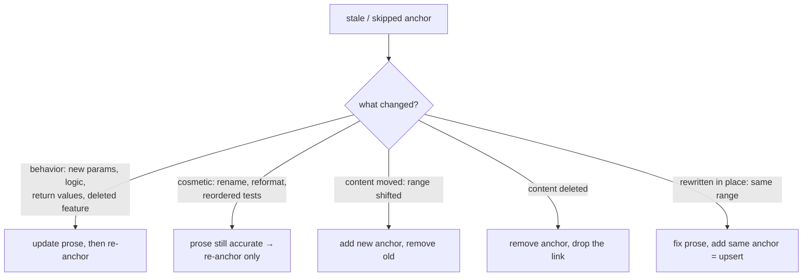

# Resolving skipped fixes

`wiki check --fix` fail-closes on mesh drift it can't resolve automatically and names the exact `wiki mesh` command to run. Three verbs cover every case: `show`, `add`, `remove`.

The named command is the *mechanism*, not the *decision*. A stale anchor says "the cited bytes changed," not "re-hash me" — and the point of coverage is that a code change surfaces as *this article may now be wrong*. Re-hashing without reading converts that signal into a green check while the prose silently lies.

## Confirm before you re-anchor

For each drifted anchor, before any `wiki mesh add`:

1. `wiki mesh show <slug> --patch` — read the committed-vs-worktree diff.
2. Read the page prose around the fragment link.
3. Answer: **does the diff change what the code does, or only how it looks?**

Only then pick a path below. Don't batch-re-add over `show` output to clear the exit code.

## Classify and act



**Rewritten in place / cosmetic (range unchanged)** — upsert re-hashes:
```bash
wiki mesh add <slug> packages/cli/src/foo.rs#L10-L40
```

**Moved (range changed)** — add new *then* remove old. This ordering keeps the mesh alive: a single-anchor mesh isn't deleted when the old anchor goes. `remove` is idempotent (missing anchor → `nothing to remove`, exit 0), so the pair is safe to re-run:
```bash
wiki mesh add    <slug> <new-anchor>
wiki mesh remove <slug> <old-anchor>
```

**Deleted** — drop the anchor and the prose link:
```bash
wiki mesh remove <slug> <anchor>   # then delete the fragment link from the page
```

There is **no** `reanchor` or `rebaseline` verb by design: `add` upserts on exact `(path, start, end)` identity, so re-pointing and re-hashing are the same command.

## Update neighbors, then stage together

If your prose edit makes a *linked* page inaccurate too, fix that page before moving on. `wiki mesh` writes directly to `.wiki/`; running it by hand means staging by hand:

```bash
git add .wiki/ wiki/
git commit -m "wiki: re-anchor <slug> after <what changed>"
```

Then `wiki check` to confirm the failure clears. "Just re-add the anchors" / "batch it" removes the *recovery* effort, not the *per-anchor confirmation* — if that shorthand conflicts with the confirm step, surface it rather than dropping the step silently.

## Merge conflict residue

After a merge that touched both sides' `.wiki/` meshes, `wiki check --fix` automatically resolves most conflicts (see `./fixing-mesh-coverage.md`). Two cases produce **residue** — conflict markers that `--fix` cannot collapse — and the mesh is **not** re-staged until manually resolved.

### 1. Conflicted source file

The code file an anchor targets still has `<<<<<<<` / `>>>>>>>` markers. `--fix` cannot hash a conflicted file, so it leaves the entire mesh untouched and names the source file in the report. The fix is plain:

1. Resolve the code file's conflict markers.
2. Run `wiki check --fix` again — the mesh collapses automatically.

### 2. Diverged `--why` rationale

Both sides changed the mesh's `--why` rationale text differently. Anchor lines resolve cleanly (they point to resolved source), but the `why` line retains `<<<<<<<` / `>>>>>>>` residue. To resolve:

1. Open the `.wiki/<slug>.mesh` file.
2. Edit the `why:` line to remove the markers and keep the correct rationale.
3. Stage the mesh: `git add .wiki/<slug>.mesh`
4. `wiki check --fix` confirms clean state.

Because a mesh with residue still reports as dirty, the commit stays blocked — which is the safe default. The `--fix` pre-pass report lists each mesh's status: fully resolved, partially resolved (with the reason), or skipped.
