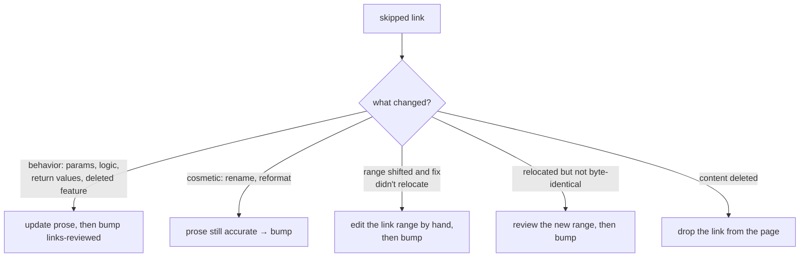

```bash
wiki check --fix             # usual pass: clear mechanical drift first
wiki check                   # read-only; every page under CWD
wiki check path/to/page.md   # explicit globs (**/*.md patterns included), resolved from CWD
```

One pass validates frontmatter and links and classifies every line-range link against its certification baseline. Kind vocabulary and exit codes: [Diagnostics](../reference/diagnostics.md). Healthy and moved links are silent.

Selection follows CWD; links resolve against the repo root, so a subdirectory run equals repo-relative globs from root.

## Flags that matter

- `--fix` — relocate moved links, route broken targets through renames, initialize `links-reviewed:`. Worktree only.
- `--fix-dry-run` — preview rewrites; requires `--fix`.
- `--print-applied` — stdout = one rewritten repo-relative path per line; everything else on stderr. Lets callers stage exactly what changed.
- `--no-exit-code` — report-only; suppressed diagnostics never set the exit code (the hook's mode). Repo-discovery and argument failures still exit 2.
- `--source worktree|index|head` — validate another snapshot: staged (`index`) for pre-commit, committed (`head`) for CI. Uncommitted pages are invisible at `head`.

## Anchor cache

History walks memoize in the merged generations store under `<git common dir>/wiki/store.sqlite`, shared across worktrees, keyed by exact git-log output — history changes invalidate it naturally. Faults degrade to uncached with one warning. Slow or stale-looking checks: `wiki check --clear-cache`; `WIKI_ANCHOR_CACHE=0` disables permanently.

## `./.wikiignore`

`./.wikiignore` at the repo root excludes paths before any validation, on every command and source ([loader](/packages/cli/src/wikiignore.rs#L12-L27)). Gitignore syntax, anchored at repo root; a deeper `!pattern` cannot resurrect an excluded directory's children. Malformed pattern = exit 2 (fail closed). Ignored targets are exempt from `broken_link`.

## Shallow clones fail closed

Anchor lookup needs full history; shallow clones error (exit 2) rather than guess. CI needs `fetch-depth: 0`. With `--no-exit-code` the error prints but exits 0 — protection resumes when the clone deepens.

## When --fix skips

`--fix` relocates moved content and refuses to guess at the rest. A skip names the *mechanism* ("the cited bytes changed"), not the decision — bumping `links-reviewed:` without reading converts "this article may be wrong" into a green check with lying prose.

For each skipped link:

1. Read the cited range's history: `git log -L <start>,<end>:<file>` (or blame the range).
2. Read the page prose around the link.
3. Decide: does the change alter what the code does, or only how it looks?

Never batch-bump fields to clear an exit code.



**Bump** = change the page's `links-reviewed:` value after every flagged link on the page is resolved (any change re-certifies; increment):

```yaml
links-reviewed: 2   # was 1
```

Per-page field: one bump re-certifies every line-range link on it together.

- **Moved, relocated honestly** (`fixed:` line, byte-identical destination) — nothing to do.
- **Moved, "not byte-identical" skip** — href already rewritten; review the new range, then bump.
- **Moved, skipped entirely** (ambiguous or no rename evidence) — edit the fragment by hand, then bump.
- **Deleted target, no successor** — drop the link. If other range links remain, bump.

There is no `reanchor` verb by design: re-pointing links and re-certifying are page edits, never CLI commands ([initialization is the only field write](/packages/cli/src/commands/drift.rs#L1949-L1966), insert-when-absent only).

If your prose edit makes a linked page inaccurate too, fix that page before moving on. Commit as plain page edits, then `wiki check` to confirm the failure cleared.
