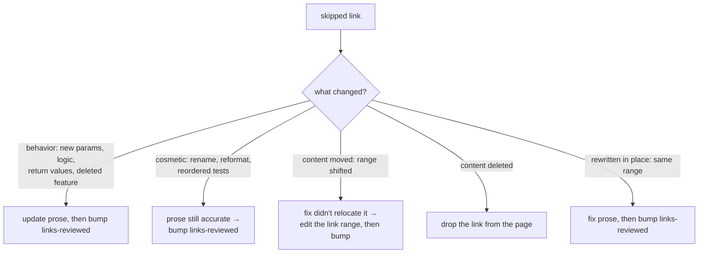

# Resolving skipped fixes

`wiki check --fix` relocates line-range links whose certified content *moved*, and refuses to guess at the rest. A skip names the link and the reason. The reason is the *mechanism*, not the *decision*: a drifted link says "the cited bytes changed," not "re-certify me" — the point of the anchor is that a code change surfaces as *this article may now be wrong*. Bumping `links-reviewed:` without reading converts that signal into a green check while the prose silently lies.

## Confirm before you re-certify

For each skipped link:

1. Read the cited range's history: `git log -L <start>,<end>:<file>` (or open the file and blame the range).
2. Read the page prose around the fragment link.
3. Answer: **does the change alter what the code does, or only how it looks?**

Only then pick a path below. Don't batch-bump fields over skip output to clear the exit code.

## Classify and act



The field is per-page, not per-link: every line-range link on a page is certified together, so one bump re-certifies the whole page. Bump only after you've confirmed every drifted link on the page.

**Cosmetic or rewritten-in-place (range unchanged)** — review, then bump the page's `links-reviewed:` value (any change re-certifies; increment the number):

```yaml
links-reviewed: 2   # was 1
```

**Moved (range changed)** — `--fix` relocates these automatically when the moved content is found unambiguously. When it skips instead (ambiguous match, multi-match, content edited during the move), edit the fragment link's range by hand, then bump:

```markdown
[parse_args()](./packages/cli/src/main.rs#L40-L80)   # re-point the range
```

**Deleted** — drop the fragment link from the page. No bump is needed when no line-range links remain (an empty page stops being checked), but if other links stay, bump after the edit.

There is **no** `reanchor` verb by design: the anchor is derived from git history at the commit where `links-reviewed:` last changed. Re-pointing a link and re-certifying the page are page edits, not CLI commands.

## Update neighbors, then stage together

If your prose edit makes a *linked* page inaccurate too, fix that page before moving on. All changes are plain page edits:

```bash
git add wiki/
git commit -m "wiki: re-certify <page> after <what changed>"
```

Then `wiki check` to confirm the failure clears. "Just bump the field" / "batch it" removes the *recovery* effort, not the *per-link confirmation* — if that shorthand conflicts with the confirm step, surface it rather than dropping the step silently.
